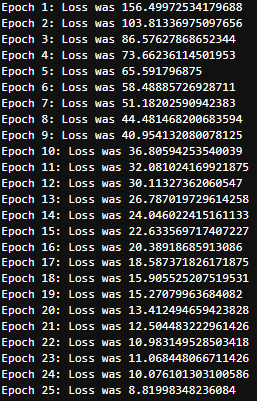
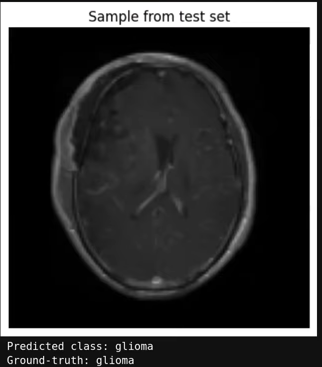
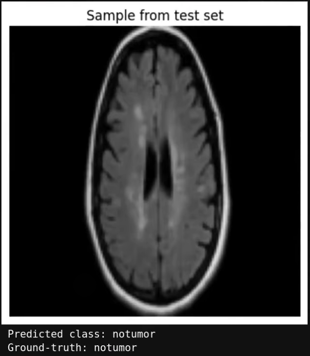

# 🧠 TumourScan-AI  
*A Deep Learning Brain Tumor Classifier built with PyTorch*

## 💡 About This Project  

**TumourScan-AI** is a deep learning project designed to classify brain MRI scans into different tumour categories. The model demonstrates how artificial intelligence can be used for medical image analysis in a research and educational context.  

Built using **PyTorch**, this project explores image preprocessing, model training, evaluation, and prediction visualization — providing a complete workflow for image-based classification tasks.

> ⚠️ **Disclaimer:** TumourScan-AI is strictly for **educational and research purposes**.  
> It must **not** be used for any clinical, diagnostic, or treatment-related decisions.

## 🧩 How It Works  

### 🔹 1. Training the Model  
The model is trained over **25 epochs**, progressively minimizing loss as it learns to recognize tumour patterns in MRI scans. During training, the loss value decreases significantly — indicating successful learning and convergence.

**Example Output:**

*(The loss steadily decreases from ~156 in Epoch 1 to ~8.8 in Epoch 25, showing strong learning progress.)*

### 🔹 2. Model Evaluation  
After training, the model is evaluated on unseen test data. It achieves a **test accuracy of approximately 97%**, showing high reliability in classifying tumour types.

**Example Output:**

Test Loss: 0.1256
Test Accuracy: 97.02%

### 🔹 3. Prediction on Random MRI Samples  
When the final notebook cell is executed, the model selects a random MRI image from the test dataset, displays it, and predicts its class. The prediction and ground-truth label are shown below the image for easy comparison.

**Example Predictions:**

| Predicted Class | Ground Truth |
|-----------------|---------------|
| Glioma          | Glioma        |

| Predicted Class | Ground Truth |
|-----------------|---------------|
| No Tumour       | No Tumour     |

## 📁 Dataset
The model uses the Brain Tumour MRI Dataset from Kaggle, which was published in 2021.

📦 **[Brain Tumor MRI Dataset](https://www.kaggle.com/datasets/masoudnickparvar/brain-tumor-mri-dataset)** from Kaggle, which contains MRI images categorized by tumour type.  

Please download the dataset from Kaggle and place it in the **same directory** as the TumourScan-AI project files, so that the notebook can access it during training and testing.

